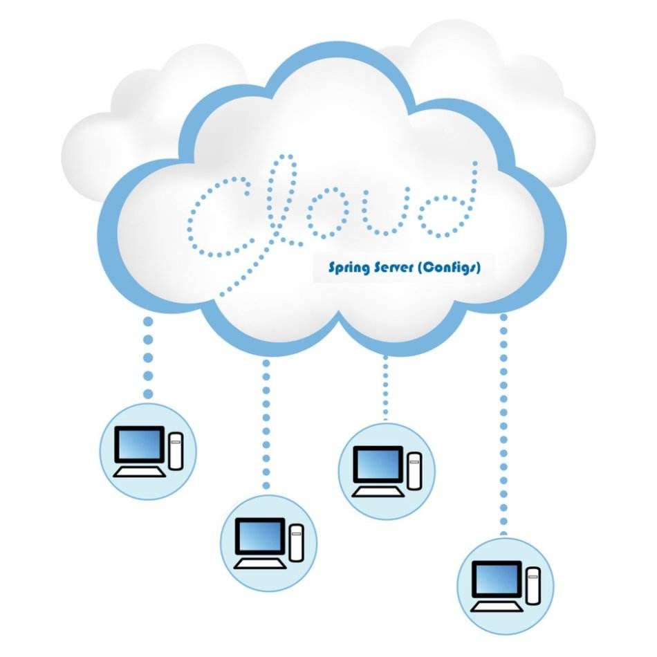

## Translate Code   基于FFMPEG的转码集群

### 一键安装


#### SPRING cloud框架

- mvn clean install

#### FFMPEG

- ./configure
- make -j8 && make install

### 采用框架及功能

- common包含共同的bean、常量、异常处理类
- api-server网关
- spring cloud config
- eureka服务治理
- schedualer调度系统
- translate转码服务
- 转码能力层采用ffmpeg

### 特性

- 转码速度取决于cpu数量及配置
- 上传文件速率受限于带宽
- 转码分辨率可自定义
- 转码和上传分别进行流量控制，以防止系统瘫痪。
- 当流量受限或者网络超时导致转码故障，schedualer会定期检测未完成任务补偿任务。


### 测试样例

```
http://localhost:9000/add POST

{
	"resourceId":"qqwsdedsdfsdcsdrfdsvasdvadfadv",
	"resourceName":"天下有情人",
	"fileFormat":"mp4",
	"translateBizInfoList":[
		{"srcFilePath":"d:/apple.mp4","targetBiteRate":"640:480","targetFileName":"apple001.mp4"},
		{"srcFilePath":"d:/apple.mp4","targetBiteRate":"720:640","targetFileName":"apple002.mp4"},
		{"srcFilePath":"d:/apple.mp4","targetBiteRate":"1280:720","targetFileName":"apple003.mp4"},
		{"srcFilePath":"d:/apple.mp4","targetBiteRate":"1440:1080","targetFileName":"apple004.mp4"}
		]
}
```

### 相关资源

- [配置文件](https://github.com/wanghuan578/spring-cloud-config-repos)(spring cloud config)。


### 作者和贡献者信息

- spirit(57810140@qq.com)

